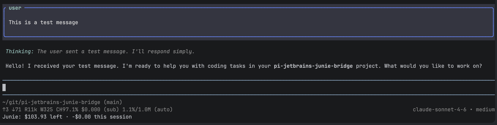

# pi-jetbrains-junie-bridge

A [Pi](https://pi.dev/) extension that lets you use [JetBrains Junie](https://junie.jetbrains.com/) as the AI backend for the Pi coding agent — using your existing Junie subscription.

## Install

```bash
pi install npm:pi-jetbrains-junie-bridge
```

Then inside `pi` run the `/login` command.  Select `Use a subscription` and then `JetBrains Junie` to authenticate.

Once authenticated, run `/model` to select a model provided by the junie bridge.

## Features

- **OAuth login** — browser-based JetBrains authentication with automatic token refresh
- **Balance tracking** — session cost and remaining balance shown in Pi's status line (see footer)
  
- **`/junie` command** — check proxy status, balance, and available models from within Pi
  

## Available Models

Only OpenAI and Anthropic (Claude) models are supported. Google/Gemini models are **not supported** — the Grazie backend requires a native protocol for these and rejects the OAuth tokens used by this proxy.

**Recommendation:** Use the Claude models — only Anthropic models send reasoning blocks (extended thinking) to Pi, which significantly improves coding output quality.

**Anthropic:**
- `claude-sonnet-4-6`
- `claude-sonnet-5`
- `claude-opus-4-6`
- `claude-opus-4-7`
- `claude-opus-4-8`
- `claude-fable-5`

**OpenAI:**
- `openai-gpt-5-2`
- `openai-gpt-5-4` — reasoning effort not adjustable (OpenAI limitation with tool use)
- `openai-gpt-5-5` — reasoning effort not adjustable (OpenAI limitation with tool use)

## Proxy Support

The extension respects the standard `HTTPS_PROXY` / `HTTP_PROXY` environment variables. This is useful in corporate environments where internet access is only available through a proxy.

All outgoing requests to JetBrains (OAuth and Grazie backend) are routed through the configured proxy. Local traffic between Pi and the bridge stays direct.

```bash
# Example
export HTTPS_PROXY=http://proxy.corp.example.com:8080
```

You can verify the active proxy with the `/junie` command inside Pi.

## Requirements

- Node.js 20+
- A [JetBrains Junie subscription](https://junie.jetbrains.com/)


## How It Works

The extension starts a local proxy server that translates between Pi and JetBrains' Grazie backend. On first use, you'll authenticate via JetBrains OAuth (browser-based PKCE flow).

```
┌─────────┐     ┌──────────────┐     ┌──────────────┐
│   Pi    │────>│  pi-junie    │────>│ Junie/Grazie │
│ agent   │     │  local proxy │     │   backend    │
└─────────┘     └──────────────┘     └──────────────┘
```

- OpenAI models (`openai-gpt-*`) are forwarded via `/v1/chat/completions`
- Anthropic models (`claude-*`) are forwarded via `/v1/messages`
- The proxy runs on an ephemeral port and shuts down when Pi exits

## Disclaimer

This extension includes a proxy server reverse-engineered from the official [JetBrains Junie CLI](https://github.com/JetBrains/junie).
It is not officially supported by JetBrains. Use it in accordance with the [JetBrains AI Service Terms of Service](https://www.jetbrains.com/legal/docs/toolbox/ai-service-terms/).

## License

MIT
