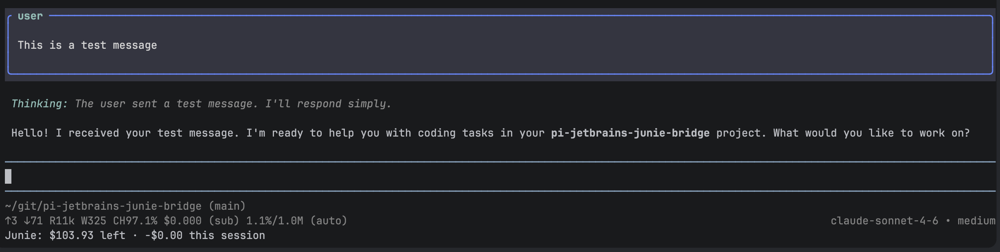

# pi-jetbrains-junie-bridge

A [Pi](https://pi.dev/) extension, [OpenCode](https://opencode.ai/) plugin and OpenAI-compatible server that lets you use [JetBrains Junie](https://junie.jetbrains.com/) as the AI backend — using your existing Junie subscription.

## Install

```bash
pi install npm:pi-jetbrains-junie-bridge
```

Then inside `pi` run the `/login` command.  Select `Use a subscription` and then `JetBrains Junie` to authenticate.

Once authenticated, run `/model` to select a model provided by the junie bridge.

### OpenCode

Install the package as an OpenCode server plugin:

```bash
opencode plugin pi-jetbrains-junie-bridge
```

Restart OpenCode after installation. The plugin registers three sibling
providers on equal footing (`junie-openai` via `@ai-sdk/openai`, `junie-google`
via `@ai-sdk/google`, `junie-anthropic` via `@ai-sdk/anthropic`), starts its
own local bridge, and reads JetBrains Junie OAuth credentials from a shared file
(`$JUNIE_BRIDGE_CREDENTIALS`, else `%APPDATA%/junie-bridge/credentials.json` /
`~/.config/junie-bridge/credentials.json`) — the same file the `junie-bridge`
server uses. A single login covers all three providers. The token is re-read and
refreshed before every request via the `chat.headers` hook.

OpenCode's `/connect` list is sourced from its built-in provider catalog and
does not show custom plugin providers as **JetBrains Junie**. To authenticate,
run this from PowerShell or another terminal:

```bash
opencode auth login --provider junie-openai
```

Alternatively, choose **Other** in `/connect`, enter `junie-openai` (or
`junie-google` / `junie-anthropic`) as the provider ID, and choose the Junie
login method. After login, select models with `junie-openai/<model-id>`,
`junie-anthropic/<model-id>` or `junie-google/<model-id>` (e.g.
`junie-openai/openai-gpt-5-2`). You can also authenticate once with the shared
login:

```bash
npx junie-bridge login
```

Pi keeps its own credential store, while OpenCode and the standalone
`junie-bridge` server share the same file and bridge logic — each host still
runs its own ephemeral bridge, so Pi and OpenCode may run at the same time.

### Standalone OpenAI-compatible server

The same bridge can be used by external OpenAI-compatible clients without Pi or
OpenCode:

```powershell
npx junie-bridge --port 8787
```

Authenticate once with the shared Junie browser login, then start the server:

```powershell
npx junie-bridge login
npx junie-bridge --port 8787
```

The login stores a refreshable credential in the user profile (override its
location with `JUNIE_BRIDGE_CREDENTIALS`). The server requires this login — per-request `Authorization` headers are ignored.

The server listens on `127.0.0.1` by default. Set `JUNIE_HOST` or `JUNIE_PORT`, or
pass `--host` and `--port`, to change that. Configure the client with base URL
`http://127.0.0.1:8787/v1`. The server exposes `/v1/models`,
`/v1/responses`, and `/v1/chat/completions`; Claude models use `/v1/messages`
through the existing family-specific bridge routing. Use port `0` (the default)
for an ephemeral port, which is printed when the server starts.

The standalone server also exposes Junie diagnostics:

```powershell
Invoke-RestMethod http://127.0.0.1:8787/junie/balance
Invoke-RestMethod http://127.0.0.1:8787/junie/test
```

`/junie/balance` reports the license, monthly and top-up credit balances, quota,
and account status. `/junie/test` checks connectivity through the configured
proxy. These endpoints require the saved login (`junie-bridge login`).

For a local checkout, do not pass the Windows directory to `opencode plugin`.
Add the plugin file to OpenCode's config instead:

```json
{
  "plugin": ["file:///C:/Users/you/path/to/pi-jetbrains-junie-bridge"]
}
```

Put this in `$USERPROFILE/.config/opencode/opencode.jsonc` (or
`%USERPROFILE%\.config\opencode\opencode.jsonc` on Windows), or in a project
`opencode.jsonc` for project-only loading. Replace the path with the absolute
location of your checkout and restart OpenCode, then authenticate with the
command above.

## Features

- **OAuth login** — browser-based JetBrains authentication with automatic token refresh
- **Balance tracking** — session cost and remaining balance shown in Pi's status line (see footer) while a Junie model is selected
  
- **Pi `/junie` command** — check proxy status, balance, and available models from within Pi
  
- **OpenCode `junie_status` tool and `/junie` command** — run `/junie` in OpenCode
  to display balance, connectivity, proxy diagnostics, and backend models that are
  unknown or explicitly blacklisted, along with the readable license name and links
  to top up credits or upgrade to AI Ultimate. The command is a prompt template that invokes
  the tool, so it uses one normal agent turn rather than a direct TUI command.
- **Automatic context compaction** — when a conversation outgrows the model's context
  window, Pi compacts it and retries instead of failing. This works out of the box for
  all four model families: the bridge passes the backend's original overflow error
  through unchanged, so Pi's built-in detection recognises it (verified live against
  Claude, OpenAI, Grok and Gemini).
- **OpenCode-native authentication and provider catalog** — browser OAuth, verified
  model limits, family-specific routing, and a post-turn `TASK RESULT` line with
  elapsed time, Junie credit cost, and remaining balance. Balance toasts remain
  available as a transient notification.

## Available Models

Anthropic (Claude), OpenAI, xAI (Grok) and Google (Gemini) models are supported. The reasoning effort is adjustable in Pi.

The list below is mostly in sync with the models Junie itself offers, as published at <https://llm24.net/llm/junie.txt>.

**Anthropic:**
- `claude-sonnet-4-6`
- `claude-sonnet-5`
- `claude-opus-4-6`
- `claude-opus-4-7`
- `claude-opus-4-8`
- `claude-opus-5`
- `claude-fable-5`

**OpenAI:**
- `openai-gpt-5-2`
- `openai-gpt-5-4`
- `openai-gpt-5-5`
- `openai-gpt-5-6-luna`
- `openai-gpt-5-6-terra`
- `openai-gpt-5-6-sol`

**xAI:**
- `grok-4-3`
- `grok-4-5`

**Google:**
- `gemini-3-flash-preview`
- `gemini-3.1-pro-preview`
- `gemini-3.1-flash-lite`
- `gemini-3.5-flash-lite`
- `gemini-3.6-flash`

Missing models:
- **`deepseek-v4-flash`** — explicitly blacklisted. JetBrains routes DeepSeek through
  AliCloud, and every path/header combination tried so far is rejected by the Grazie
  gateway for subscription OAuth tokens. If the backend returns it, it appears only
  in diagnostics and is hidden from both hosts.
- **Older OpenAI generations** (`gpt-5-2025-08-07`, `gpt-5.3-codex`) — reachable, but deliberately left out in favour of the current GPT-5 models.
- **`gpt`, `grok`, `gemini-pro`, `gemini-flash`** — stale aliases in that list; the backend answers `Model not found` for them.

## Proxy Support

The extension respects the standard `HTTPS_PROXY` / `HTTP_PROXY` environment variables. This is useful in corporate environments where internet access is only available through a proxy.

All outgoing requests to JetBrains (OAuth and Grazie backend) are routed through the configured proxy. Local traffic between Pi and the bridge stays direct.

```bash
# Example
export HTTPS_PROXY=http://proxy.corp.example.com:8080
```

You can verify the active proxy with the `/junie` command inside Pi.

## Requirements

- Node.js 22.18.0+
- A [JetBrains Junie subscription](https://junie.jetbrains.com/)


## How It Works

The extension starts a local proxy server that translates between Pi and JetBrains' Grazie backend. On first use, you'll authenticate via JetBrains OAuth (browser-based PKCE flow).

```
┌─────────┐     ┌──────────────┐     ┌──────────────┐
│   Pi    │────>│  pi-junie    │────>│ Junie/Grazie │
│ agent   │     │  local proxy │     │   backend    │
└─────────┘     └──────────────┘     └──────────────┘
```

- OpenAI models (`openai-gpt-*`) are forwarded via `/v1/responses` (OpenAI Responses API) so reasoning effort works together with tool calls
- Anthropic models (`claude-*`) are forwarded via `/v1/messages`
- Grok models (`grok-*`) use the same Responses API, with the routing header that Junie uses for xAI
- Gemini models (`gemini-*`) are forwarded to the Vertex-style `generateContent` endpoint
- The proxy runs on an ephemeral port and shuts down when Pi exits
- OpenCode starts and shuts down an independent ephemeral bridge for its host process
- Runtime model refresh updates availability only; unknown backend IDs remain diagnostic-only

## Testing

See [`docs/testing.md`](./docs/testing.md) for how to verify the Pi extension (`--extension` vs `pi install`), the three OpenCode providers (`junie-openai`/`junie-google`/`junie-anthropic`), and the standalone `junie-bridge` server (`/v1/chat/completions`, `/v1/responses`, `/v1/messages`) — including the `provider`/`model` two-column `pi --list-models` table (grep for `junie`).

## Disclaimer

This extension includes a proxy server reverse-engineered from the official [JetBrains Junie CLI](https://github.com/JetBrains/junie).
It is not officially supported by JetBrains. Use it in accordance with the [JetBrains AI Terms of Service](https://www.jetbrains.com/legal/docs/terms/jetbrains-ai-service/) and [JetBrains AI Platform Terms of Service](https://www.jetbrains.com/legal/docs/terms/jetbrains-ai-platform/).

## License

MIT
